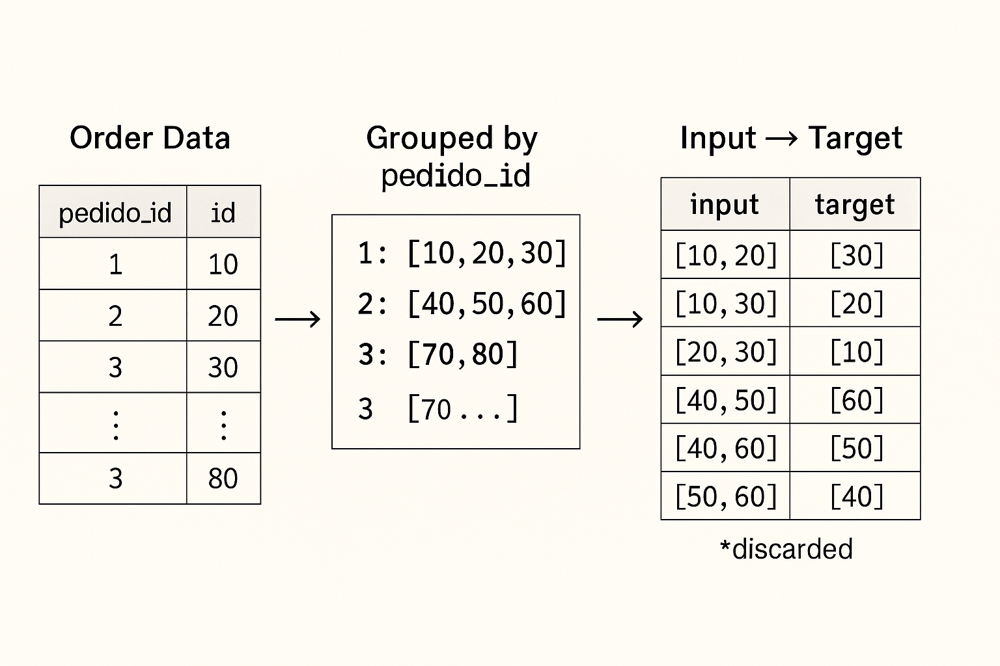

# Estructura y Generación del Dataset CSV para el Sistema de Recomendación

Este documento explica en detalle cómo se construye el dataset CSV utilizado por el sistema de recomendación de productos, desde los datos originales de pedidos hasta el formato final input-target.

## 📊 Origen de los Datos

El dataset de entrenamiento se construye a partir de los registros históricos de pedidos de clientes. Cada pedido contiene múltiples productos que fueron adquiridos juntos, representando patrones naturales de compra.

## 🛒 Estructura de la Base de Datos Original

La información original suele estar almacenada en una estructura como la siguiente:

| pedido_id | producto_id |
|-----------|-------------|
| 1         | 1001        |
| 1         | 1003        |
| 1         | 1005        |
| 2         | 1002        |
| 2         | 1003        |
| 2         | 1007        |
| 3         | 1001        |
| 3         | 1005        |
| 3         | 1007        |

Esta tabla representa el "Detalle de Pedido" donde cada fila indica que un producto específico fue parte de un pedido determinado.

## 🔄 Proceso de Transformación

El siguiente diagrama ilustra el proceso completo de transformación de los datos originales al formato final input-target:



### Paso 1: Agrupar productos por pedido

El primer paso consiste en agrupar todos los productos que forman parte del mismo pedido:

```python
{
  1: [1001, 1003, 1005],
  2: [1002, 1003, 1007],
  3: [1001, 1005, 1007]
}
```

Cada uno de estos grupos representa una "cesta de compra" o "basket" completa.

### Paso 2: Generar pares input-target

Para cada pedido, generamos todas las combinaciones posibles de `m` productos como input (en nuestro caso, `m=2`), y el resto de productos del mismo pedido como target:

#### Pedido 1: [1001, 1003, 1005]

Combinaciones posibles donde cada input tiene exactamente 2 productos:
- Input: `[1001, 1003]` → Target: `[1005]`
- Input: `[1001, 1005]` → Target: `[1003]`
- Input: `[1003, 1005]` → Target: `[1001]`

#### Pedido 2: [1002, 1003, 1007]

- Input: `[1002, 1003]` → Target: `[1007]`
- Input: `[1002, 1007]` → Target: `[1003]`
- Input: `[1003, 1007]` → Target: `[1002]`

#### Pedido 3: [1001, 1005, 1007]

- Input: `[1001, 1005]` → Target: `[1007]`
- Input: `[1001, 1007]` → Target: `[1005]`
- Input: `[1005, 1007]` → Target: `[1001]`

### Paso 3: Casos especiales

Si un pedido contiene exactamente `m` productos (en nuestro caso, 2), o menos, no puede generar ejemplos de entrenamiento válidos ya que no quedaría ningún producto para el target. Estos casos son descartados.

Si un pedido contiene muchos productos, puede generar numerosas combinaciones, lo que podría desequilibrar el dataset. En algunos casos, se puede limitar la cantidad de combinaciones por pedido para mantener un balance.

## 📄 Formato Final del CSV

El resultado final es un archivo CSV con dos columnas:

```csv
input,target
"[1001,1003]","[1005]"
"[1001,1005]","[1003]"
"[1003,1005]","[1001]"
"[1002,1003]","[1007]"
"[1002,1007]","[1003]"
"[1003,1007]","[1002]"
"[1001,1005]","[1007]"
"[1001,1007]","[1005]"
"[1005,1007]","[1001]"
```

Notas importantes sobre el formato:
- Tanto `input` como `target` son representados como strings que contienen listas de enteros en formato JSON.
- El `input` siempre tiene exactamente `m` productos (en este caso, 2).
- El `target` puede tener uno o más productos, dependiendo del tamaño del pedido original.

## 💡 Código de Generación

A continuación se muestra un ejemplo simplificado de código Python que podría usarse para generar este CSV a partir de datos de pedidos:

```python
import pandas as pd
import json
from itertools import combinations

# Supongamos que tenemos un DataFrame con los detalles de pedidos
detalle_pedidos = pd.DataFrame({
    'pedido_id': [1, 1, 1, 2, 2, 2, 3, 3, 3],
    'producto_id': [1001, 1003, 1005, 1002, 1003, 1007, 1001, 1005, 1007]
})

# Agrupar productos por pedido
pedidos = {}
for pedido_id, grupo in detalle_pedidos.groupby('pedido_id'):
    pedidos[pedido_id] = grupo['producto_id'].tolist()

# Generar pares input-target
m = 2  # Tamaño fijo de input
datos_entrenamiento = []

for pedido_id, productos in pedidos.items():
    if len(productos) <= m:
        continue  # Ignorar pedidos con m o menos productos
    
    # Generar todas las combinaciones posibles de m productos
    for input_productos in combinations(productos, m):
        # El target es el resto de productos que no están en el input
        target_productos = [p for p in productos if p not in input_productos]
        
        if target_productos:  # Asegurarse de que hay al menos un producto en el target
            datos_entrenamiento.append({
                'input': list(input_productos),
                'target': target_productos
            })

# Crear DataFrame y guardar como CSV
df_entrenamiento = pd.DataFrame(datos_entrenamiento)

# Convertir listas a strings para el formato CSV
df_entrenamiento['input'] = df_entrenamiento['input'].apply(json.dumps)
df_entrenamiento['target'] = df_entrenamiento['target'].apply(json.dumps)

# Guardar en CSV
df_entrenamiento.to_csv('train_input_target_m2_n>=1.csv', index=False)
```

## 🎯 Interpretación y Uso

Este formato de dataset permite al modelo de recomendación aprender patrones como:
- "Cuando un cliente compra los productos X e Y, es probable que también compre el producto Z"
- "Los productos A y B suelen comprarse junto con los productos C y D"

En la fase de inferencia, cuando un cliente selecciona ciertos productos (input), el modelo puede predecir qué otros productos (target) podrían interesarle, basándose en los patrones aprendidos de compras anteriores.

## 🔬 Consideraciones Adicionales

- **Actualización periódica**: El dataset debería actualizarse regularmente para incorporar nuevos patrones de compra.
- **Filtrado de ruido**: En implementaciones reales, se suelen aplicar filtros para eliminar productos poco comunes o combinaciones muy raras.
- **Balanceo de clases**: Algunos productos pueden aparecer con mucha más frecuencia que otros, lo que podría sesgar el modelo. Técnicas de balanceo pueden aplicarse para mitigar este problema.
- **Validación cruzada**: Es recomendable dividir los datos en conjuntos de entrenamiento y validación para evaluar el rendimiento del modelo antes de implementarlo en producción. 